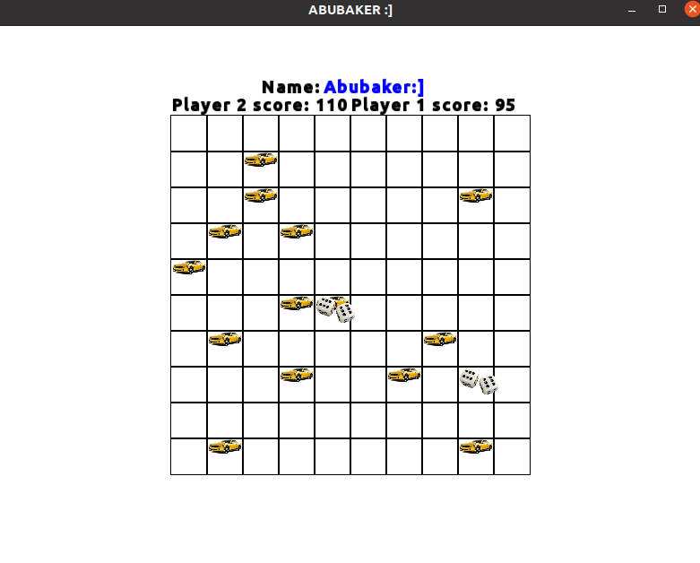

# Multi-Player-Game-Using-Pthread-and-SFML-RANDOM-MOVEMENT-OF-PLAYERS

Multi Player Game in which players can move randomly and collect items on the board.
It is done using OS concepts parallel processing and multi-threading

